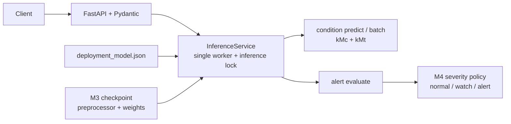

# Maritime CBM

[](https://github.com/krapnuyij/maritime-cbm/actions/workflows/ci.yml?query=branch%3Amain)

시뮬레이션 기반 다변량 선박 가스터빈 센서 데이터에서 압축기·터빈 열화 상태를
추정하고, 제한된 조건에서 경보 정책의 가능성을 검토하는 PoC이다.

## 프로젝트 범위

- UCI `Condition Based Maintenance of Naval Propulsion Plants` 데이터 사용
- 정상상태 센서값으로부터 `kMc`, `kMt` 열화 상태 계수를 추정하는 다중 출력 회귀
- 회귀 예측값을 이용한 제한적 경보 정책 검토
- M3 선형 잔차 MLP를 제공하는 FastAPI 추론 API와 Docker 실행 환경

이 데이터에는 타임스탬프와 실제 고장 라벨이 없다. 따라서 이 프로젝트를 시계열 예측,
미래 고장 예측, 잔여수명 예측 또는 실제 선박 고장진단으로 해석하지 않는다.

## 현재 상태

M0 프로젝트 기반 구성부터 M5 FastAPI·Docker 서비스화까지 로컬 구현과 검증을 완료했다.
공개본 정리를 PR #1로 `main`에 반영했고, merge commit `3fde859`의 GitHub Actions
run `35828745744`에서 `Quality`와 `Docker Smoke`가 모두 성공했다. 릴리스 준비 문서를
PR #2와 merge commit `952ac13`로 반영한 뒤 main CI run `35875824288`을 통과했고,
[최초 공개 버전 `v0.1.0`](https://github.com/krapnuyij/maritime-cbm/releases/tag/v0.1.0)에
실제 M3 checkpoint와 `SHA256SUMS`를 배포했다.

세부 범위와 진행 상황은 다음 문서에서 관리한다.

- [프로젝트 명세](docs/PROJECT_SPEC.md)
- [현재 진행 상황](docs/CURRENT_STAGE.md)
- [데이터셋 안내](docs/DATASET.md)
- [실험 기록](docs/EXPERIMENT_LOG.md)
- [모델 카드](docs/MODEL_CARD.md)
- [Artifact 배포 정책](docs/ARTIFACTS.md)

## 개발 환경

- Python 3.13
- uv
- scikit-learn
- PyTorch
- FastAPI, Pydantic과 Uvicorn
- Docker
- Ruff
- pytest

환경을 구성하고 기본 검증을 실행한다.

```bash
uv sync --locked --group eda --group service
uv run --locked --group eda --group service ruff check .
uv run --locked --group eda --group service ruff format --check .
uv run --locked --group eda --group service pytest -q
```

## CI 검증 범위

GitHub Actions는 Ubuntu에서 lock 파일, Ruff, 포맷과 pytest를 검증하는 `Quality` job과
합성 checkpoint로 컨테이너 보안 설정·기동·5개 endpoint를 확인하는 `Docker Smoke` job을
실행하도록 구성했다. 공개본 merge commit `3fde859`의 최초 push에서 두 job이 모두
성공했다. 원본 UCI 파일은 재배포하지 않으며, 실제 checkpoint는 Git과 CI에 포함하지 않고
`v0.1.0` GitHub Release asset으로 별도 배포한다.

원본에서 확인한 `kMc` 우선·`kMt` 차순의 9행 상태 그룹 블록 배치를 재현한 합성 격자로,
문서화된 분할 해시 12개가 Ubuntu CI에서 재현됐다. 실제 분할 해시 검증은 합성 격자가
원본과 같은 상태 그룹 블록 배치를 갖는다는 조건 아래에서만 대체한다. 원본 파일 로딩과
EDA 관찰 수치는 원본이 있는 macOS와 Linux/aarch64 환경에서 별도로 검증했다. 현재 CI에서는
원본 검증 3개, 배포 입력 범위 검증 1개와 실제 checkpoint API 검증 1개가 데이터·artifact
부재로 skip된다. 합성 checkpoint smoke test는 서비스 동작 검증이며 모델 성능 결과가
아니다.

EDA 그림까지 재생성하려면 전용 의존성 그룹을 추가로 설치한다.

```bash
uv sync --group eda
uv run --group eda python -m maritime_cbm.data.eda
```

## 기준 모델 재현

M2 모델 선택은 validation만 사용하고, 선택 manifest를 고정한 뒤 test를 한 번 평가한다.

```bash
uv sync --locked --group eda
uv run --locked --group eda python -m maritime_cbm.modeling.benchmark select
uv run --locked --group eda python -m maritime_cbm.modeling.benchmark evaluate
```

기본 상태 그룹 validation에서 선택된 모델은 300개 tree를 사용하는 다중 출력 Random
Forest다. 상태 그룹 test의 R²는 `kMc` 0.9967, `kMt` 0.9928이지만, 학습에서 보지 못한
심한 열화 방향 holdout에서는 오차가 크게 증가했다. 결과를 실제 고장진단이나 미관측
열화 상태에 대한 보장으로 해석하지 않는다. 세부 결과는 [모델 카드](docs/MODEL_CARD.md)와
[모델링 리포트](reports/modeling/)에 있다.

## PyTorch 비교 모델 재현

M3도 validation 전용 선택과 고정 checkpoint test 평가를 분리한다. 공식 결과는 CPU에서
생성하며 MPS는 선택 실행 경로로만 제공한다.

```bash
uv sync --locked --group eda --group modeling
uv run --locked --group eda --group modeling python -m maritime_cbm.modeling.torch_benchmark select --device cpu
uv run --locked --group eda --group modeling python -m maritime_cbm.modeling.torch_benchmark evaluate --device cpu
```

선택된 모델은 속도 중심화 선형 잔차 MLP다. 상태 그룹과 심한 열화 방향 holdout 모두 M2
Random Forest보다 오차가 감소했지만 holdout의 건강 방향 bias는 남아 있다. M2 결과를 본 뒤
구조를 설계했으므로 완전히 미관측인 독립 test 성능으로 주장하지 않는다. 상세 결과는
[M3 리포트](reports/modeling/m3/)와 [모델 카드](docs/MODEL_CARD.md)에 있다.

## 경보 정책 재현

M4는 모델을 재학습하지 않는다. M2·M3 evaluation manifest와 저장된 test 예측의
SHA-256을 검증하고, 상태 그룹 validation에서만 고정 오경보율 cutoff를 정한 뒤 기존 test에
그대로 적용한다.

```bash
uv sync --locked --group eda --group modeling
uv run --locked --group eda --group modeling python -m maritime_cbm.alerting.benchmark
```

주 임계값 0.8에서 상태 그룹 `any` Recall은 M2 0.9245, M3 0.9558이고 FPR은 각각
0.0009, 0이다. 심한 열화 방향 holdout의 대상 Recall은 M2가 압축기 `kMc`와 터빈 `kMt`
모두 0인 반면 M3는 각각 1.0000, 0.9316이다. 두 holdout은 정상 표본이 없는 단일 클래스이므로
Precision·FPR·PR-AUC는 `NA`이며 실제 고장 탐지 성능으로 해석하지 않는다. 상세 결과는
[경보 정책 리포트](reports/alerting/)와 [모델 카드](docs/MODEL_CARD.md)에 있다.

## API와 Docker 실행

M5 서비스는 상태 계수 추정과 경보 정책 평가를 별도 endpoint로 제공한다. 서비스 시작 시
버전 관리되는 배포 계약과 실제 checkpoint의 SHA-256, 후보·seed·전처리 metadata, 입력·
target 순서, 허용 속도와 PyTorch 기본 버전을 대조하며 불일치하면 시작하지 않는다.



실제 M3 checkpoint가 다음 기본 경로에 있어야 한다.

```text
artifacts/modeling/m3/checkpoints/state_group_seed_42.pt
```

`v0.1.0` Release에서 asset을 받으면서 Compose가 기대하는 이름과 경로로 저장한다.
직접 재현하려면 앞의 M3 재현 명령으로 checkpoint를 생성한다.

```bash
mkdir -p artifacts/modeling/m3/checkpoints

curl --fail --location \
  --output artifacts/modeling/m3/checkpoints/state_group_seed_42.pt \
  https://github.com/krapnuyij/maritime-cbm/releases/download/v0.1.0/maritime-cbm-m3-linear-residual-mlp-v1.pt
```

다운로드한 파일은 서비스가 읽기 전에 배포 계약과 같은 SHA-256인지 확인한다. Release asset의
이름을 로컬에서 바꿔도 파일 내용과 SHA-256은 달라지지 않는다.

```bash
printf '%s  %s\n' \
  'cbb56741b2a9209afea71bfdc7b8f0a575b2ece4e0795343170e2c3c086cf472' \
  'artifacts/modeling/m3/checkpoints/state_group_seed_42.pt' \
  | shasum -a 256 -c -
```

배포·제외 대상과 라이선스·신뢰 경계는 [Artifact 배포 정책](docs/ARTIFACTS.md)에 정리했다.

- `GET /health`: 서비스와 모델 준비 상태
- `GET /model/info`: 배포 모델·입력·경보 정책 계약
- `POST /v1/condition/predict`: 단건 `kMc`, `kMt` 추정
- `POST /v1/condition/batch`: 순서를 보존한 1~100건 추정
- `POST /v1/alert/evaluate`: 입력 계수에 M4 PoC 정책 적용

```bash
uv sync --locked --group service
uv run --locked --group service uvicorn maritime_cbm.api.app:app \
  --host 127.0.0.1 --port 8000 --workers 1
```

다른 터미널에서 상태 추정과 경보 정책을 호출한다.

```bash
curl --fail http://127.0.0.1:8000/health

curl --fail --header 'content-type: application/json' \
  --data '{"v":3.0,"GTT":289.964,"GTn":1349.489,"GGn":6677.38,"Ts":7.584,"T48":464.006,"T2":550.563,"P48":1.096,"P2":5.947,"Pexh":1.019,"TIC":7.137,"mf":0.082}' \
  http://127.0.0.1:8000/v1/condition/predict

curl --fail --header 'content-type: application/json' \
  --data '{"kMc":0.96,"kMt":0.98}' \
  http://127.0.0.1:8000/v1/alert/evaluate
```

Docker Compose는 checkpoint를 read-only로 마운트하고 non-root 단일 worker, read-only root
filesystem과 capability 제거 설정으로 실행한다. 기본 포트가 사용 중이면 호스트 포트만
변경할 수 있다.

```bash
docker compose build
docker compose up

MARITIME_CBM_PORT=18080 docker compose up
```

고정 프로토콜의 Docker/Linux API benchmark는 다음 명령으로 재현한다.

```bash
uv run --locked --group service python scripts/benchmark_service.py \
  --image maritime-cbm:m5-local \
  --checkpoint artifacts/modeling/m3/checkpoints/state_group_seed_42.pt \
  --data data/raw/uci_cbm/data.txt \
  --output-directory reports/service \
  --host-port 18082 \
  --platform linux/arm64
```

로컬 Docker/Linux ARM64에서 요청 오류 없이 측정한 평균 지연시간은 cold start 1,452.024ms,
단건 1.438ms, 100건 batch 3.901ms였다. idle process RSS는 352.652MiB, peak process RSS는
355.934MiB였다. 같은 image ID에서 `docker image inspect .Size`는 354,694,718 byte
(338.263MiB), `docker system df -v`의 virtual size는 1.7GB였다. 단일 MacBook과 순차 요청
조건의 결과이므로 클라우드 처리량이나 SLA로 일반화하지 않는다. 상세 조건과 산출물은
[서비스 리포트](reports/service/)에 있다.

## 데이터 준비와 검증

원본 데이터는 [데이터셋 안내](docs/DATASET.md)에 따라 직접 내려받아 다음 위치에 둔다.

```text
data/raw/uci_cbm/
├── data.txt
├── Features.txt
└── README.txt
```

파일을 배치한 뒤 공식 구조와 격자를 검증한다.

```bash
uv run python -m maritime_cbm.data.validation
```

다른 위치를 사용한다면 디렉터리를 위치 인자로 전달한다.

```bash
uv run python -m maritime_cbm.data.validation /path/to/uci_cbm
```

## 디렉터리 구조

```text
.
├── data/                  # 로컬 데이터, Git 제외
│   ├── raw/
│   └── processed/
├── artifacts/             # 로컬 모델·행 단위 예측, Git 제외
│   ├── modeling/
│   └── alerting/
├── config/                # 추적되는 배포 모델·입력·정책 계약
├── docs/                  # 명세, 데이터 및 실험 문서
├── reports/eda/           # 재현 가능한 집계 EDA 표와 핵심 그림
├── reports/modeling/      # M2·M3 집계 지표와 핵심 그림
├── reports/alerting/      # M4 경보 정책 집계 지표와 핵심 그림
├── reports/service/       # M5 Docker/Linux API benchmark 결과
├── scripts/               # 합성 smoke bundle·service benchmark 실행 도구
├── src/maritime_cbm/      # 애플리케이션 패키지
├── tests/                 # 자동화 테스트
├── Dockerfile             # non-root multi-stage API image
├── compose.yaml           # read-only 로컬 서비스 실행
├── pyproject.toml         # 프로젝트 및 도구 설정
└── uv.lock                # 재현 가능한 의존성 잠금 파일
```

원본 데이터는 저장소에 포함하지 않는다. 다운로드와 인용 방법은
[데이터셋 안내](docs/DATASET.md)를 따른다.

## 라이선스

프로젝트 코드는 [MIT License](LICENSE)를 따른다. UCI 데이터셋은 별도의
[CC BY 4.0](https://creativecommons.org/licenses/by/4.0/) 라이선스를 따르며,
프로젝트의 MIT License가 데이터셋에 적용되지는 않는다. 원본 데이터와 학습된 checkpoint의
배포 범위는 [Artifact 배포 정책](docs/ARTIFACTS.md)을 따른다.
